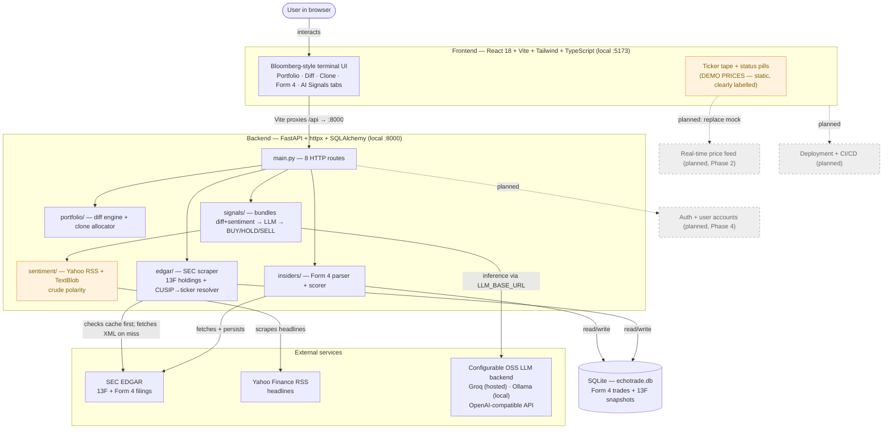

# EchoTrade AI — System Architecture (current state)

> **Living document.** Reflects what's actually built today. Update in the same PR
> whenever a component or data flow changes. Renders automatically on GitHub.
> Nodes marked **(planned)** are on the roadmap but not built.

## How to read this
Boxes are components; arrows show what data flows. Solid = built and working today.
Dashed/**(planned)** = roadmap, not yet built.

## What's real vs not (today)
- **Real & working:** live SEC 13F ingestion, diff engine, clone allocator, Form 4
  parser + scorer (role/value-weighted, cluster detection), full React UI wired
  across all 5 tabs, SQLite cache for Form 4.
- **Real but crude:** sentiment (TextBlob is keyword-based, not finance-aware).
- **AI Signals:** verified end-to-end via Groq (`llama-3.3-70b-versatile`). Configure
  via `.env` — see `.env.example` for Groq and Ollama options.
- **Static / labelled:** ticker tape shows demo prices, clearly marked "DEMO PRICES"; status pills say DEMO + AI (not LIVE/OLLAMA).
- **Not present:** auth, user persistence, real-time prices, deployment.

## Stack (actual)
- **Backend:** Python 3.13, FastAPI, httpx (async), SQLAlchemy 2.0, SQLite,
  openai-sdk (OpenAI-compatible, pointed at any backend via env vars).
- **Frontend:** React 18, Vite, Tailwind 3, TypeScript.
- **LLM:** configurable — default Ollama local (`llama3.1:8b`), recommended hosted
  Groq (`llama-3.3-70b-versatile`, free tier). All open-source, per CLAUDE.md.
- **Persistence:** ~5MB SQLite file (gitignored). **Deployment:** none yet.
- **Tests:** pytest, `tests/test_parse_response.py` (6 cases, passing).

_Last updated: 13F snapshot cache added (filing_snapshots table, transparent read-through)._
