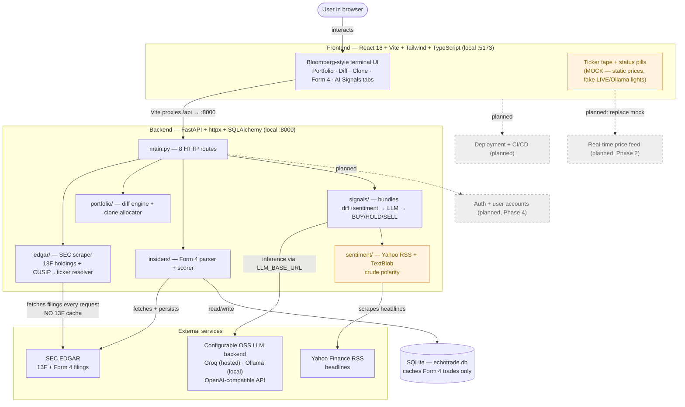

# EchoTrade AI — System Architecture (current state)

> **Living document.** Reflects what's actually built today. Update in the same PR
> whenever a component or data flow changes. Renders automatically on GitHub.
> Nodes marked **(planned)** are on the roadmap but not built.

## How to read this
Boxes are components; arrows show what data flows. Solid = built and working today.
Dashed/**(planned)** = roadmap, not yet built.

## What's real vs not (today)
- **Real & working:** live SEC 13F ingestion, diff engine, clone allocator, Form 4
  parser + scorer (role/value-weighted, cluster detection), full React UI wired
  across all 5 tabs, SQLite cache for Form 4.
- **Real but crude:** sentiment (TextBlob is keyword-based, not finance-aware).
- **Ready to verify:** AI Signals pipeline is wired and error-handled; Groq free
  tier confirmed as a working backend (set LLM_BASE_URL + LLM_API_KEY in .env).
  End-to-end verification pending first live run.
- **Mock / cosmetic:** ticker tape (static prices), LIVE + OLLAMA status lights.
- **Not present:** auth, user persistence, real-time prices, deployment,
  and 13F caching (13F is re-fetched from SEC on every request — a known gap).

## Stack (actual)
- **Backend:** Python 3.13, FastAPI, httpx (async), SQLAlchemy 2.0, SQLite,
  openai-sdk (OpenAI-compatible, pointed at any backend via env vars).
- **Frontend:** React 18, Vite, Tailwind 3, TypeScript.
- **LLM:** configurable — default Ollama local (`llama3.1:8b`), recommended hosted
  Groq (`llama-3.3-70b-versatile`, free tier). All open-source, per CLAUDE.md.
- **Persistence:** ~5MB SQLite file (gitignored). **Deployment:** none yet.
- **Tests:** pytest, `tests/test_parse_response.py` (6 cases, passing).

_Last updated: PR #1 merged — configurable LLM backend, first tests, error handling._
